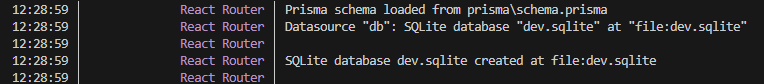

# My Setup & Development Log

My goal was to set up the Shopify app project as requested in the technical task. Here are the steps I took to get the project running.

### 1. Initial Setup and Naming Issues

First, I created a new public GitHub repo

I tried to create the app using `npm init @shopify/app@latest`. I ran into my first problem when I tried to name my folder `shopify-product-metafield-app` 
The CLI gave me an error because u'r not allowed to use the name "shopify" in the app name.

To fix this, I change the project nname to  `product-metafield-app`, which fixed the naming error.

### 2. The Dev Store "Loop" Problem

After I created the app files, I ran `shopify app dev` to start the project.

I got stuck in a CLI loop. It kept asking me to create a new dev store, even after I created one. 

I figured out the problem was very tricky:
- My CLI was logged into my new "Dev Dashboard"
- But I was creating my store in my old "Partner Dashboard"
- Even though it's the same account, the CLI could not "see" the store I was creating.

## what I did
1.  I archived the old store from the Partner Dashboard.
2.  I went to the correct Dev Dashboard 
3.  I createt new  store `product-metafield-app-store-2` from inside the Dev Dashboard.

After I did this, I ran `shopify app dev` again, and it finally connected to the correct store.

### 3. Fixing the Database (SQLite to PostgreSQL)

The app finally ran, but it crashed with a React `useContext` error.

I looked at the terminal log and saw the problem:
`Datasource "db": SQLite database "dev.sqlite"`

The app was using SQLite by default, but the task requires PostgreSQL.

**To fix this, I did three things:**

1. Edit prisma/schema.prisma: I changed the provider from `"sqlite"` to `"postgresql"`.
2. Create `.env` file: The project was missing a `.env` file. I created one and added my `DATABASE_URL` to connect to my local PostgreSQL server.
3. Fix the Migration: When I tried to run `npx prisma migrate dev`, I got an error: `ERROR: type "datetime" does not exist`. This is because the old migration file was made for SQLite, which uses `datetime`, but PostgreSQL uses `timestamp`.

## what I did
- Solution: I deleted the entire `prisma/migrations` folder and the `prisma/dev.sqlite` file to start fresh.
- Then I ran `npx prisma migrate dev --name "init-postgres"`.
- This created a brand new, correct migration file for PostgreSQL, and it worked perfectly.

### 4. Final Success

After fixing the database, I ran `shopify app dev` one last time. The app loaded perfectly with no errors.
