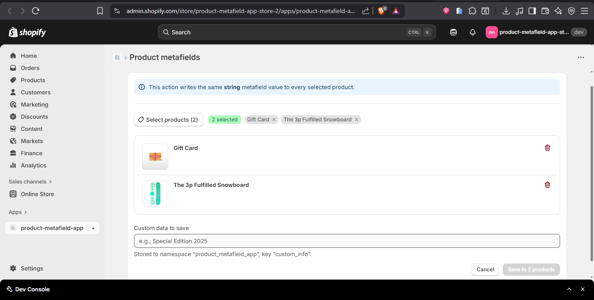

## What I did
- Built a product metafield page with Polaris and I used Css for beter style.
- Added a Resource Picker to select one or more products.
- Added a text field for a custom value.
- On save, the app calls Shopify Admin GraphQL to create/update a metafield on each selected product.
- Simple toasts and badges for feedback.

## How it works
1. The page loads with `loader()` to ensure the admin session is valid.
2. Click “Select products” to open the App Bridge resource picker and choose products.
3. Enter a value in “Custom data to save”.
4. Click Save.

- The `action()` runs the `metafieldsSet` mutation for each product.
- Namespace: `product_metafield_app`
- Key: `custom_info`
- Type: `string`

5. On success, the UI clears the form and shows a success toast.
   On error, it shows the first error message.

## What I changed in this commit
* `app/routes/app._index.tsx`
- New SaveMetafield UI (Polaris + App Bridge).
- Uses `useFetcher` to submit the form to the Remix `action()`.
- Client-only wrapper to avoid App Bridge on the server.
- GraphQL call to `metafieldsSet` for the selected product IDs.

* `app/routes/app.tsx`
- Wraps the app with ShopifyAppProvider (embedded) and PolarisAppProvider.

* `app/root.tsx`
Injects styles with using `links()` and preconnects Shopify fonts.

* `app/styles/app-index.css`
- Styles for list, tags, and layout.

Btw I imported Polaris CSS is  in both `root.tsx`  and `app.tsx` (on 1st didn't work for me that's why I imported it on both files !!)
It works, but I will keep just one source later to avoid double loading ( next commit !!)

And these I already set up in the first commit:
- PostgreSQL running and `DATABASE_URL` in `.env`
- Prisma migrated (`npx prisma migrate dev`)
- Store connected in the CLI

## My next step is :
- Add a Theme App Extension