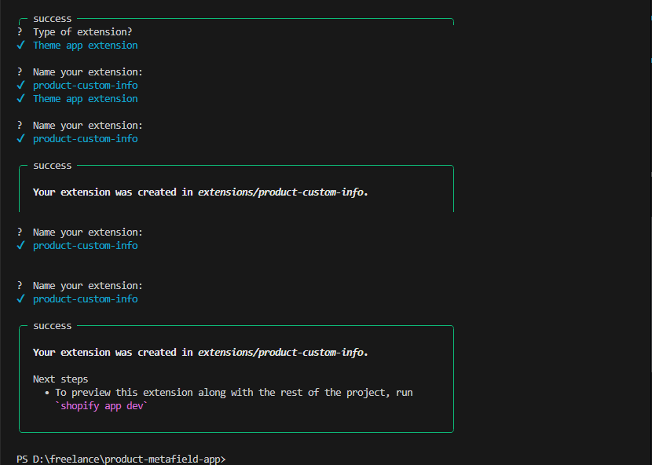
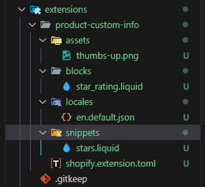
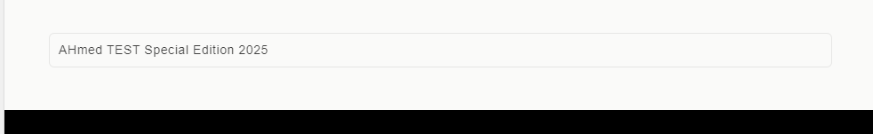

1. I run `shopify app generate extension`
2. I choose `Theme app extension`
3. I called `product-custom-info`

Shopify generated the extension folder and files

Then I removed the demo files to keep the code simple and clean
- extensions/product-custom-info/blocks/star_rating.liquid
- extensions/product-custom-info/snippets/stars.liquid
- extensions/product-custom-info/assets/thumbs-up.png

 

Then I create 

==>I create this to defines a Theme App Block that shows on my product metafield on the product page

## Note: I generated this Liquid with AI because I’m new to Shopify’s templating language
[text](../extensions/product-custom-info/blocks/product-custom-info.liquid)

==>Style CSS
[text](../extensions/product-custom-info/assets/custom-info.css)

I created a metafield definition for:

- Namespace: product_metafield_app
- Key: custom_info
- Type: single_line_text_field
- Owner: PRODUCT

To match this, I changed the server code to save the same type:
// was: const TYPE = "string";
const TYPE = "single_line_text_field";

